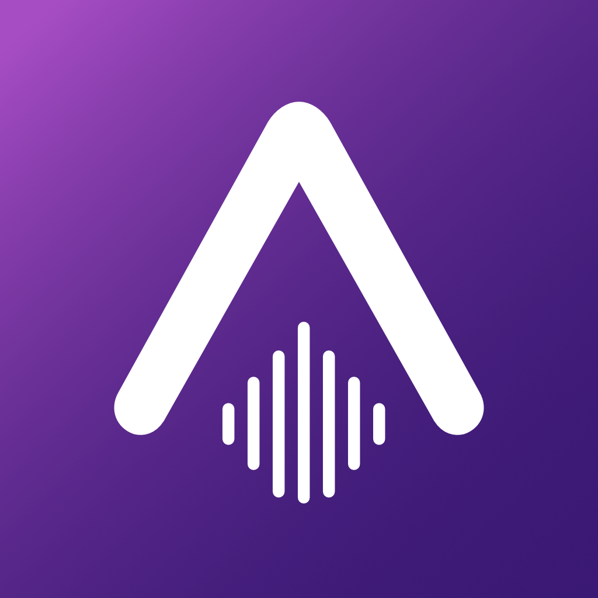

<div align="center">

  

  # 🎵 AuraMusic
  ### *Cinematic • Fluid • Atmospheric • Android-First*

  <p align="center">
    <b>A flagship-grade, serverless Android music player with native AndroidX Media3 playback, direct on-device stream resolution, and a signature Liquid Glass design language.</b>
  </p>

  <!-- Badges -->
  <p align="center">
    <a href="#-tech-stack"></a>
    <a href="#-tech-stack"></a>
    <a href="#-architecture"></a>
    <a href="#-tech-stack"></a>
    <a href="#-tech-stack"></a>
  </p>

  <!-- AI Engineering Badge Banner -->
  <p align="center">
    
    
    
    
    
  </p>

  <p align="center">
    <a href="#-preview"><b>Preview</b></a> •
    <a href="#-why-auramusic"><b>Why AuraMusic?</b></a> •
    <a href="#-features"><b>Features</b></a> •
    <a href="#-architecture"><b>Architecture</b></a> •
    <a href="#-search--queue-intelligence"><b>Search & Queue</b></a> •
    <a href="#-tech-stack"><b>Tech Stack</b></a> •
    <a href="#-quick-start"><b>Quick Start</b></a> •
    <a href="#-ai-engineering-tooling"><b>AI Tools</b></a>
  </p>

  <sub>🚀 <b>v2.0.0 — Official Release</b> | Distributed as source code & standalone signed APK builds.</sub>

</div>

---

## 🔮 Atmospheric Vision

> *"AuraMusic is not a generic music player. It is a cinematic Android-first listening experience inspired by emotional design language, layered visual depth, and native audio fidelity."*

AuraMusic pairs modern **React Native (Expo SDK 55)** UI ergonomics with a robust, bare-metal **Kotlin Native Core** powered by **AndroidX Media3 (ExoPlayer)** and **Room Database**. It bypasses intermediate server infrastructure by executing stream resolution, audio buffering, media sessions, and offline downloads directly on-device.

---

## 📸 Preview

<div align="center">

```text
┌──────────────────────────────────────────────────────────────────────────────────┐
│                                                                                  │
│                        ✨ [ LIQUID GLASS INTERFACE PREVIEW ] ✨                   │
│                                                                                  │
│   ┌───────────────────┐  ┌───────────────────┐  ┌───────────────────┐            │
│   │     🏠 Home       │  │    🔍 Search      │  │   🎧 Now Playing  │            │
│   │  Dynamic Gradients│  │ Multi-Signal Rank │  │ Synced LRC Lyrics │            │
│   │  Atmospheric Blur │  │  Intent Filtering │  │ Liquid Artwork Glass│          │
│   └───────────────────┘  └───────────────────┘  └───────────────────┘            │
│                                                                                  │
│      [ High-Resolution Showcase & Demo Screen Recordings will be linked here ]   │
│                                                                                  │
└──────────────────────────────────────────────────────────────────────────────────┘
```

*(Screenshots will be uploaded prior to the tagged v0.1.0-beta.1 GitHub release assets)*

</div>

---

## 💎 Why AuraMusic?

Most mobile music clients fall into one of two extremes: thin web wrappers with sluggish media controls, or fragile setups requiring complex self-hosted cloud proxy servers.

AuraMusic brings flagship polish directly to your Android device:

* ⚡ **Direct On-Device Stream Resolution:** Resolves raw streaming media directly in Kotlin without depending on external proxy servers or middleman scraping services.
* 🛡️ **Authoritative Native Android Pipeline:** Media timeline, playback positions, and queue states are maintained strictly in Kotlin on the Android OS thread for glitch-free playback.
* 🌌 **Liquid Glass Material:** An original aesthetic built around 38–54 blur radius hierarchies, dynamic album-art gradient tinting, and fluid gesture-driven navigation.
* 🧠 **Vibe-Aware Dynamic Continuation:** Never lets the music die. Blends online radio automix streams with local listening history affinity and diversity rules.
* 💾 **Local-First SQLite Persistence:** Instantaneous state recovery, offline cataloging, and local history tracking via an on-device Room SQLite database.

> [!NOTE]
> *AuraMusic is an open-source, lightweight personal music player and audio explorer, not a commercial replacement for licensed subscription platforms.*

---

## ✨ Features

AuraMusic includes only verified, actively implemented functionality:

### 🎧 Playback & Media Engine
* 🚀 **AndroidX Media3 / ExoPlayer Core:** Hardware-accelerated audio pipeline with low-latency decoding and adaptive buffer management.
* ⏱️ **Authoritative Native Timeline:** Zero state desynchronization between background services, lock screen, and UI widgets.
* 🔔 **Android Media Controls & Lock Screen:** Deep integration with Android `MediaSessionCompat` / Media3 `MediaSession` with reactive metadata, seekbars, and notification actions.
* 🔋 **Background Playback & Wake Locks:** Reliable background execution via Android Foreground Service (`FOREGROUND_SERVICE_MEDIA_PLAYBACK`).
* 🎚️ **System Equalizer Delegation:** Direct intent launch to system/OEM hardware equalizers (`openSystemEqualizer`) linked to the active Android Audio Session ID.
* 🎛️ **Precise Seeking & Volume Normalization:** Smooth timeline scrubbing and software volume attenuation support.

### 🔍 Discovery & Intelligence
* 🔎 **Intelligent Search Engine:** Multi-signal matching utilizing token overlap, exact prefix matching, and Jaro-Winkler string similarity.
* 🎵 **Music-Focused Filtering:** Automatic classification that filters out podcasts, reaction videos, and UGC noise in favor of official releases.
* 🎯 **Search Intent Detection:** Accurately categorizes queries targeting tracks, artists, albums, or playlists to display contextual top-result cards.
* 🧬 **Deduplication & Canonical Merging:** Deduplicates identical re-uploads while strictly preserving intentional variants (remixes, live tours, acoustic sets).
* 🌊 **Vibe-Aware Dynamic Queue & Autoplay:** Generates 8–10 track continuation queues via mathematical scoring (`Score = Relational + Affinity + Session - Fatigue`) with strict diversity constraints (max 3 tracks per artist, max 2 per album, 4-position artist separation).

### 📚 Library & Offline Support
* 📥 **Native Download Engine:** Standalone background download manager powered by Media3 `DownloadManager` and `DownloadService` with parallel chunking and resume support.
* ✈️ **100% Offline Playback:** Seamlessly plays downloaded tracks directly from the local file cache with zero network access.
* 📜 **Synchronized Lyrics System:** Real-time synced LRC lyrics rendering powered by **LRCLIB** and **KuGou**, backed by local Room database caching and an LRU memory cache.
* 📊 **Listening History & Analytics:** Tracks local play counts, completion rates, skip actions, and daily listening sessions for on-device taste profiling.
* 📁 **Local Music Scanner:** Scans and indexes local audio tracks stored on device storage.
* 🎴 **Custom Playlists:** Full playlist CRUD (create, reorder, add/remove, pin) backed by Room database entities and TypeScript Zustand state mirrors.

### 🎨 Liquid Glass UI & Design System
* 🪟 **Atmospheric Glass Surfaces:** Refractive blur hierarchy (38–54 blur radius) with translucent borders and soft atmospheric lighting.
* 🎨 **Dynamic Artwork Theming:** Real-time extraction of ambient gradient hues from album covers.
* 💫 **Kinetic Gestures & Motion:** Reanimated v4 gesture-driven modals, collapsible now-playing sheets, and fluid spring animations.
* ⚡ **High-Density Virtualized Lists:** Uses `@shopify/flash-list` for smooth 60–120 FPS scrolling across large playlists and search queries.

*(Note: In-app software DSP equalizers, audio crossfade, and gapless playback toggles are intentionally excluded from the active codebase to preserve Media3 pipeline stability.)*

---

## 🏗 Architecture

AuraMusic utilizes a modular bridge architecture separating the presentation layer from hardware-sensitive media execution.

```text
React Native (Expo SDK 55)
├── Presentation Layer (Liquid Glass UI, React Navigation, Reanimated)
├── State Management (Zustand Stores)
└── Search & Queue Orchestration
        │
        ▼ React Native Bridge (NativeModules & EventEmitters)
Native Android Bridge (`com.auramusic.core.bridge`)
        ├── AuraPlayerModule (Playback lifecycle & event streaming)
        ├── AuraYouTubeModule (Search & InnerTube operations)
        ├── AuraDownloadModule (Media3 download scheduling)
        ├── AuraHistoryModule (History tracking)
        ├── AuraPlaylistModule (Room playlist CRUD)
        └── AuraLyricsModule (Multi-provider lyrics fetching)
        │
        ▼
Kotlin Music Core (`com.auramusic.core`)
        ├── YouTube / InnerTube Engine (Direct API client, protobuf payload builder)
        ├── Unified Stream Resolver (WEB_REMIX & ANDROID_VR format resolvers)
        ├── PoToken & BotGuard Manager (Headless WebView token generation)
        ├── AndroidX Media3 / ExoPlayer (Audio engine, timeline management)
        ├── AuraMediaSessionService (Android foreground service & MediaSession)
        ├── Download Engine (Media3 DownloadManager & cache storage)
        └── Room Database (SQLite storage for tracks, history, playlists, lyrics)
```

### Component Breakdown

| Layer | Technology | Primary Responsibilities |
| :--- | :--- | :--- |
| **Presentation** | React Native + Expo | Liquid Glass UI, touch interactions, route navigation, and Zustand stores. Only passes track identifiers (`videoId`) across the bridge. |
| **Native Bridge** | JNI / TurboModule Bridge | Marshals asynchronous method calls and streams continuous playback events to JS via `NativeEventEmitter`. |
| **Kotlin Core** | Kotlin Coroutines | Direct InnerTube API interactions, stream format extraction, and MediaSession lifecycle. |
| **Audio Engine** | AndroidX Media3 (ExoPlayer) | Authoritative timeline, hardware audio decoding, buffer chunking, and system notification dispatch. |
| **Local Database** | AndroidX Room (SQLite) | Persistent local storage for user playlists, listening history, downloaded track metadata, and cached lyrics. |

---

## ⚙️ Playback Architecture

```text
User Tap ──▶ Native Bridge ──▶ UnifiedStreamResolver ──▶ PoTokenManager (WebView)
                                        │
                                        ▼ (Direct HTTPS Audio Stream)
                              AndroidX Media3 ExoPlayer
                                        │
             ┌──────────────────────────┼──────────────────────────┐
             ▼                          ▼                          ▼
   Foreground Notification      MediaSessionCompat        AudioTrack Output
  (Lock Screen & Quick Settings) (WearOS, Auto, BT)      (OEM Hardware DSP)
```

1. **Authoritative Native Timeline:** The playback position, buffering states, and playlist indices are maintained exclusively within ExoPlayer on the Android main thread. The React Native UI acts as a reactive view subscribing to native state update events.
2. **Native Stream Resolution:** When a track is requested, the Kotlin `UnifiedStreamResolver` extracts unthrottled streaming URLs using a multi-stage resolution pipeline (primary `WEB_REMIX` / `ANDROID_MUSIC` format resolution with a controlled `ANDROID_VR` fallback).
3. **Headless BotGuard / PoToken Provider:** To resolve audio streams reliably, the native core utilizes an automated, headless Android WebView manager (`PoTokenManager`) to generate visitor data and proof-of-origin tokens on-device.
4. **MediaSession Integration:** A background service (`AuraMediaSessionService`) exposes an active `MediaSessionCompat` instance to Android, supporting Bluetooth headsets, Android Auto, smartwatch remotes, and lock screen media controllers.

---

## 🔍 Search & Queue Intelligence

AuraMusic implements a deterministic, multi-signal search and queue system executed directly between TypeScript and the Kotlin InnerTube client:

* 🧹 **Query Normalization:** Strips metadata clutter (`"official audio"`, `"remastered"`, `"deluxe"`, brackets, diacritics) while preserving critical musical modifiers (`remix`, `live`, `acoustic`, `slowed`, `sped up`, `cover`).
* 🎯 **Search Intent Classification:** Analyzes query structure to detect specific entity types (`ARTIST`, `ALBUM`, `PLAYLIST`, `SONG`, or discovery intents) to display contextual hero result cards.
* 📈 **Signal-Based Ranking:** Results are ranked using a composite score combining:
  * Text Relevance (Exact title/artist match, token overlap, Jaro-Winkler distance)
  * Intent Alignment (Boosts artists/albums when intended)
  * Version Integrity (Matches requested modifiers like "acoustic" or "live")
  * Music Quality Signals (Prioritizes official audio tracks over unofficial uploads and UGC)
  * Personalization Boost (Increases score for tracks already liked, downloaded, or frequently played in the local Room DB)
* 📻 **Continuation & Autoplay:** When playback reaches the end of the user-initiated queue, `AutoplayRadio` queries the streaming automix endpoint (`/v1/next`) and blends candidates with the user's on-device taste clusters using a greedy separation algorithm:

$$\text{Candidate Score} = \text{Relational} + \text{Affinity} + \text{Session} - \text{Fatigue}$$

*(Enforces greedy diversity rules: max 3 tracks per artist, max 2 per album, 4-position artist separation. No machine learning models are run on-device.)*

---

## 🔒 Local-First Philosophy

AuraMusic prioritizes user privacy, low latency, and offline resilience:

<div align="center">

| Operational Domain | On-Device Implementation (Implemented) | Remote Service Dependency |
| :--- | :--- | :--- |
| **Stream Resolution** | 📱 Handled directly in Kotlin via InnerTube | 🌐 Direct YouTube streaming endpoints |
| **Search Queries** | 📱 Local tokenization, intent & ranking | 🌐 Raw metadata from InnerTube |
| **Playback & Media** | 📱 AndroidX Media3 / ExoPlayer hardware decode | 🌐 HTTPS media stream chunks |
| **User Library & State** | 📱 100% On-device Room Database (SQLite) | 🚫 None (No remote tracking server) |
| **Offline Playback** | 📱 100% On-device Media3 local storage | 🚫 None (Zero internet required) |
| **Lyrics** | 📱 Room SQLite & LRU memory cache | 🌐 LRCLIB & KuGou APIs (Uncached only) |
| **Taste Profiling** | 📱 On-device play frequency & affinity | 🚫 None (Private to device) |

</div>

---

## 🤖 AI Engineering Tooling

AuraMusic was engineered using an advanced multi-agent AI pair programming workflow. Cutting-edge artificial intelligence agents collaborated with human engineering across every phase of the application lifecycle:

<div align="center">

| Agent / Tool | Role in AuraMusic Development | Core Contributions |
| :--- | :--- | :--- |
|  | **Lead AI Engineer & Project Manager** | Directed end-to-end engineering strategy, project roadmap management, query normalization algorithms, fuzzy search scoring heuristics, and mathematical taste clustering formulas. |
|  | **Autonomous Systems & Polish** | Spearheaded Liquid Glass UI design implementation, Reanimated gesture physics, full-codebase auditing, download queue reconciliation, and technical documentation. |
|  | **UI Making & Visual Design System** | Orchestrated UI screen layouts, Liquid Glass component styling, visual design systems, and cohesive interface aesthetics. |
|  | **Lead Architecture & Governance** | Authored the Native Core migration plan, implemented the Media3 playback pipeline, created Room database schemas, and formulated architecture rules. |
|  | **Rapid Prototyping & Utilities** | Automated test script generation, command line workflows, and prototype validation across early phases. |

</div>

---

## 🛠 Tech Stack

<div align="center">

| Layer | Technology | Version | Purpose |
| :--- | :--- | :--- | :--- |
| **UI Framework** | React Native | `0.83.6` | Mobile UI framework with New Architecture support |
| **Platform Runtime** | Expo SDK | `55.0.26` | Native modules, tooling, and config plugins |
| **Language** | TypeScript | `5.3.3` | Type-safe application logic and bridge definitions |
| **Native Platform** | Kotlin | `2.1.20` | Android music core, background services, and native modules |
| **Audio Engine** | AndroidX Media3 | `1.9.2` | Native audio decoding, streaming, buffer chunking |
| **Persistence** | AndroidX Room (KSP) | `2.7.1` | SQLite persistence for tracks, history, playlists, lyrics |
| **State Management** | Zustand | `5.0.13` | Lightweight, reactive domain-driven stores |
| **Animations** | Reanimated | `4.2.1` | Native UI thread animations and gesture handlers |
| **List Virtualization**| FlashList | `2.0.2` | High-performance virtualized 120 FPS scrolling |
| **Network Client** | OkHttp3 / Ktor | `3.5.2` | Low-level HTTP requests and streaming inside Kotlin |
| **Lyrics Providers** | LRCLIB & KuGou | REST | Synchronized and plain-text lyrics sources |
| **Build System** | Gradle | `9.0` | Android native build chain and packaging |

</div>

---

## 📋 Requirements

Ensure your development environment meets the following specifications:

* **Operating System:** Windows 10/11, macOS (12+), or Linux
* **Node.js:** `>= 18.x` (Recommended: Node 20 LTS)
* **Package Manager:** `npm` (bundled with Node)
* **Java Development Kit (JDK):** **JDK 17** (Required for React Native 0.83+ and Gradle 9)
* **Android SDK:**
  * Android SDK Build-Tools `35.0.0`
  * Android Platform SDK `35` (Android 15)
  * Minimum supported device runtime: **Android 7.0 (API Level 24)**
* **Android Studio:** Recommended for managing SDKs, virtual devices (AVD), and inspecting native code.
* **Hardware:** Physical Android device with USB debugging enabled, or an Android Virtual Device (AVD).

---

## 🚀 Quick Start

### 1. Clone the Repository

```bash
git clone https://github.com/helloabhishek2004/AuraMusic.git
cd AuraMusic
```

### 2. Install Dependencies

Install the project dependencies. This automatically applies necessary native patches using `patch-package`:

```bash
npm install
```

### 3. Verify Android Environment

Verify that your `ANDROID_HOME` environment variable is configured and `adb` is accessible in your terminal:

```bash
adb devices
```

---

## 📦 Building the Android APK

Because AuraMusic contains custom native Kotlin modules (`com.auramusic.core`), it cannot run in the generic Expo Go sandbox. It must be built as a standalone native app or development build.

### Running a Development Build

To compile the native Android app and start the Metro bundler in one step:

```bash
# Start Metro bundler and compile/deploy the debug build to a connected device
npx expo run:android
```

Alternatively, you can build and launch manually using Gradle:

```bash
# 1. Build and install debug APK to device
cd android
./gradlew installDebug
cd ..

# 2. Start the Metro bundler
npx expo start

# 3. Launch application on device
adb shell am start -n com.anonymous.AuraMusic/.MainActivity
```

### Generating a Standalone Release APK

To create an optimized, standalone unsigned Release APK:

```bash
cd android
./gradlew assembleRelease
cd ..
```

Once compilation finishes, the generated APK will be located at:
```text
android/app/build/outputs/apk/release/app-release.apk
```

*(Note: In the default project configuration, the release build uses the debug keystore for testing convenience. For distribution, configure a production keystore in `android/app/build.gradle`.)*

---

## 📂 Project Structure

```text
AuraMusic/
├── android/                   # Native Android project & Kotlin Core
│   ├── app/                   # Android application module & manifest
│   │   └── src/main/java/com/auramusic/core/
│   │       ├── backup/        # Database export/import routines
│   │       ├── botguard/      # PoToken & VisitorData managers
│   │       ├── bridge/        # React Native bridge modules
│   │       ├── db/            # Room Database, DAOs, and Entities
│   │       ├── download/      # Media3 DownloadService and utilities
│   │       ├── history/       # Playback history tracker
│   │       ├── lyrics/        # Native lyrics repository & providers
│   │       ├── playback/      # ExoPlayer, MediaSession, audio pipeline
│   │       ├── stream/        # InnerTube & AndroidVR stream resolvers
│   │       └── youtube/       # YouTube/InnerTube client engine
│   └── build.gradle           # Root Gradle configuration
├── app/                       # Expo Router file-based screens & navigation
│   ├── (tabs)/                # Main tab navigation (Home, Search, Library, Explore)
│   ├── album/                 # Dynamic album view routes
│   ├── artist/                # Dynamic artist view routes
│   ├── playlist/              # Dynamic playlist view routes
│   └── now_playing.tsx        # Full-screen Now Playing modal
├── assets/                    # Icons, splash screens, and static images
├── patches/                   # Dependency patches managed by patch-package
├── plugins/                   # Custom Expo Config Plugins (withAuraNative)
├── src/                       # Application TypeScript source
│   ├── components/            # Reusable UI primitives (Glass, Cards, Buttons)
│   ├── design/                # Design tokens (blur, spacing, typography, colors)
│   ├── features/              # Modular domain features
│   │   ├── audio/             # Native audio session & equalizer helpers
│   │   ├── lyrics/            # Synced lyrics sheet & state
│   │   ├── player/            # Player stores, controllers, and queue logic
│   │   ├── playlist/          # Playlist stores and management
│   │   ├── recommendations/   # Taste cluster & discovery models
│   │   ├── search/            # Search normalization, ranker, deduplicator
│   │   └── settings/          # User preferences and storage stats
│   ├── hooks/                 # Custom React hooks
│   ├── services/              # Native bridge bindings (native-core.ts)
│   ├── styles/                # Global style sheets
│   └── types/                 # TypeScript interfaces and contracts
├── app.json                   # Expo application configuration
└── package.json               # Node.js project manifest & dependencies
```

---

## 🤝 Contributing

Contributions to AuraMusic are welcome. To maintain architectural stability and design integrity, contributors are expected to follow these guidelines:

### Contribution Workflow
1. **Fork** the repository on GitHub.
2. **Clone** your fork locally:
   ```bash
   git clone https://github.com/<your-username>/AuraMusic.git
   cd AuraMusic
   ```
3. **Create a Feature Branch:**
   ```bash
   git checkout -b feat/your-feature-name
   ```
4. **Implement and Test:** Test your changes on a physical Android device or emulator.
5. **Verify Types and Lints:**
   ```bash
   npm run lint
   ```
6. **Commit:** Write clear, concise commit messages following standard conventional commit guidelines.
7. **Push & Open Pull Request:** Push to your fork and submit a Pull Request describing your changes and verification steps.

### Engineering Expectations
* **Respect Architectural Boundaries:** Do not embed streaming resolution or playback logic directly into React components. Keep playback inside Kotlin and state inside domain-specific Zustand stores.
* **Preserve Design Identity:** Maintain the Liquid Glass design language (prescribed blur radii, smooth springs, adaptive colors, and padding tokens). Avoid utilitarian or flat card replacements.
* **No Secret Commits:** Never commit API keys, personal credentials, or local environment configurations.
* **Validate Native Changes:** If modifying files in `android/`, verify that both debug and release builds compile without errors.

---

## 🐛 Bug Reports & Feedback

If you encounter bugs, unexpected crashes, or playback errors, please open an issue on the [GitHub Issues](https://github.com/helloabhishek2004/AuraMusic/issues) page.

Please include the following details in your report:
* **AuraMusic Version:** (e.g., `v0.1.0-beta.1`)
* **Device Model:** (e.g., `Google Pixel 7`, `Samsung Galaxy S22`)
* **Android OS Version:** (e.g., `Android 14 / API 34`)
* **Steps to Reproduce:** Clear, sequential steps leading to the issue.
* **Expected vs Actual Behavior:** What should have happened versus what occurred.
* **Logs / Screenshots:** Attach relevant screenshots, screen recordings, or output from `adb logcat -s AuraPlayer AuraYouTube NativeCore`.

---

## 🗺 Roadmap

### Current (v0.1.0-beta.1)
- [x] Complete migration to Kotlin Native Music Core & AndroidX Media3.
- [x] Direct on-device stream resolution (InnerTube WEB_REMIX & AndroidVR fallback).
- [x] On-device Room database persistence for history, lyrics, and playlists.
- [x] Native offline download queue manager and cache reconciliation.
- [x] Multi-provider synced lyrics system (LRCLIB & KuGou).
- [x] Liquid Glass aesthetic and gesture-driven Now Playing interface.

### Planned (Near-Term)
- [ ] Enhanced local library tag editing and embedded ID3 artwork extraction.
- [ ] Sleep timer integration directly linked to native playback service.
- [ ] Backup and restore export files for playlists and listening history.
- [ ] Custom playback speed and pitch controls via Media3 audio parameters.

### Long-Term Research
- [ ] Android Auto interface integration via Media3 `MediaLibraryService`.
- [ ] On-device local recommendation graph refinement using SQLite vectors.
- [ ] Dynamic color extraction improvements for high-contrast accessibility modes.

---

## ⚠️ Known Limitations

1. **Third-Party Stream Changes:** AuraMusic resolves streams directly from YouTube/InnerTube endpoints. If upstream service signatures or client parameters change, playback or search may experience temporary degradation until stream resolver headers or extraction logic are updated.
2. **BotGuard / PoToken Cold Start:** On initial launch or after token expiration, generating a fresh visitor token via the headless Android WebView may cause a brief delay (1–3 seconds) on the very first track resolution. Subsequent resolutions use cached tokens.
3. **Android Scoped Storage:** Local library file scanning is subject to Android Scoped Storage permissions (`READ_MEDIA_AUDIO` on Android 13+ / `READ_EXTERNAL_STORAGE` on earlier versions). Files in restricted system directories cannot be accessed.
4. **Offline Mode Scope:** Only tracks that have been explicitly downloaded via the Download action are available when the device is completely offline. Uncached search results and lyrics require internet connectivity.

---

## 📄 License

> **Notice:** A formal open-source license has not yet been selected for the AuraMusic repository. A finalized open-source license will be committed prior to the formal public release. Until then, all rights are reserved by the original author and contributors.

---

## ⚖️ Disclaimer

AuraMusic is an independent open-source client application developed for personal study, technical research, and experimentation with modern Android audio architecture. AuraMusic does not host, store, or distribute copyrighted media files. All search results, stream pointers, and lyrics are retrieved from third-party public web APIs and user-specified endpoints. Use AuraMusic in compliance with your local laws and the terms of service of the content providers you access.

---

## 👏 Acknowledgements

AuraMusic is made possible thanks to the following open-source projects and communities:

* [React Native](https://reactnative.dev/) & [Expo](https://expo.dev/) for the cross-platform framework and tools.
* [AndroidX Media3](https://developer.android.com/media/media3) for the robust native Android media engine.
* [Software Mansion](https://swmansion.com/) for React Native Reanimated and Gesture Handler.
* [Shopify FlashList](https://shopify.github.io/flash-list/) for virtualized list performance.
* [LRCLIB](https://lrclib.net/) for providing community-driven synchronized lyrics.
* [Zustand](https://github.com/pmndrs/zustand) for predictable, minimal state management.
* [Anthropic](https://anthropic.com/), [Google DeepMind](https://deepmind.google/), [Google Stitch](https://stitch.google/), and [OpenAI](https://openai.com/) for empowering developer workflows through intelligent coding agents and design generation.

---

## ❤️ Special Thanks

> **Massive shoutout & absolute GOAT energy to [Gokul](https://github.com/Gokul7105) ([@Gokul7105](https://github.com/Gokul7105))! 🐐🔥**

Bro literally came in clutch and sponsored my **Google Antigravity** paid plan throughout the entire development grind of AuraMusic.

From the chaotic early days when playback was straight-up broken and streams were bugging, through the intense deep-dive of rewriting the native Android Media3 core, all the way to optimizing and dropping this public beta — that support kept the whole vision alive and cooking.

Legit, AuraMusic wouldn't have made it to this stage without you backing the vision. Absolute legend, real one fr fr. 🤝✨

— **Abhishek**

