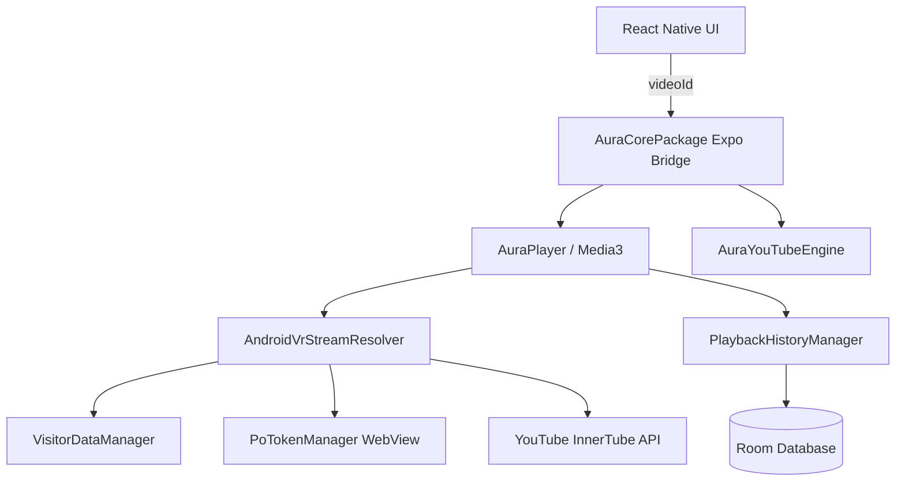

# AuraMusic Phase 2: Production Native Core Migration Walkthrough

## Objective Achieved
Successfully replaced the FastAPI/Python backend dependencies and the `react-native-track-player` library with a **100% on-device native playback and resolution core**.

## Architecture & Data Flow
The React Native frontend no longer performs HTTP stream resolution. The new architecture is a pure native pipeline:

## Key Deliverables

1. **Native YouTube Engine (`AuraYouTubeEngine.kt`)**
   - Replaces FastAPI `/search` endpoint using the `WEB_REMIX` InnerTube client directly from Kotlin.

2. **BotGuard Extraction (`PoTokenManager.kt` & `VisitorDataManager.kt`)**
   - Extracted the Phase 1B BotGuard POC into robust, concurrent-safe background managers.
   - Automatically pre-warms the hidden WebView and caches `visitorData` identifiers.

3. **Golden Stream Resolver (`AndroidVrStreamResolver.kt`)**
   - Replaces JS Cipher deciphering with the age-restriction bypass payload (`contentCheckOk: true`, `racyCheckOk: true`, `signatureTimestamp`).
   - Requests `ANDROID_VR` pre-signed MP4 audio directly.

4. **Media3 Player (`AuraPlayer.kt`)**
   - Replaces `@rntp/player` (Track Player).
   - Manages queue state, handles HTTP 403 retries silently, and orchestrates the resolution pipeline autonomously.

5. **Offline-First Database (`AuraDatabase.kt` & `PlaybackHistoryManager.kt`)**
   - Replaced React Native's async-storage analytics with a robust Room SQL database.
   - History and play counts are recorded synchronously during native playback, independently of the JS thread.

6. **React Native Bridge (`AuraCorePackage.kt` & `native-core.ts`)**
   - Complete TypeScript bindings for `AuraPlayer`, `AuraHistory`, and `AuraYouTube`.
   - Refactored `use-search.ts`, `playback.service.ts`, and `playback.controller.ts` to seamlessly intercept and route actions to the native modules.

## Next Steps
- Implement UI caching layers for offline capabilities.
- Integrate Metrolist recommendations engine natively.
